IIS网站站点布放

IIS说的是互联网信息服务,全名：Internet Information Services。是微软提供的基于运行Windows的互联网基本服务。基本的windows版本都支持IIS配置，XP,win8等家庭版的IIS一般只够支持开发等小团队使用。windows服务版支持发布站点使用。下面详细讲解win10下的IIS安装及配置。其他系统大同小易。

打开系统控制面板，找到程序与功能，然后打开程序和功能的页面。点击左边的启用或关闭windows功能。

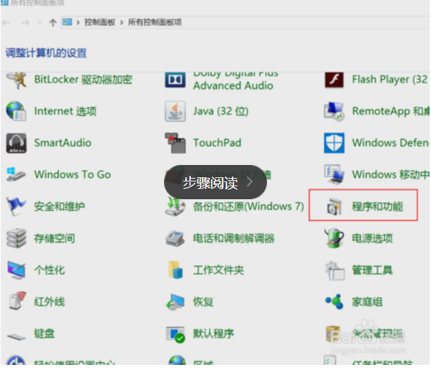
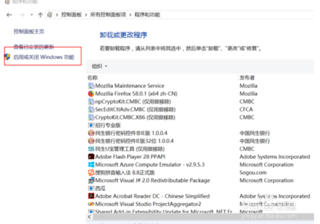
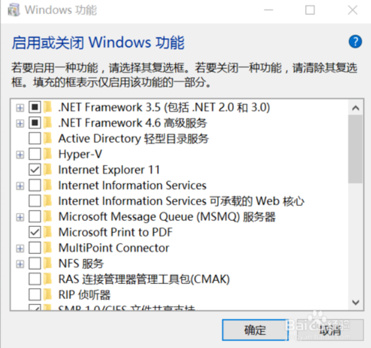

在windows功能里面我们能够看到.net framework和Internet Information Services等节点信息。如图选择需要安装的节点。点击确定。稍等即可完成安装。

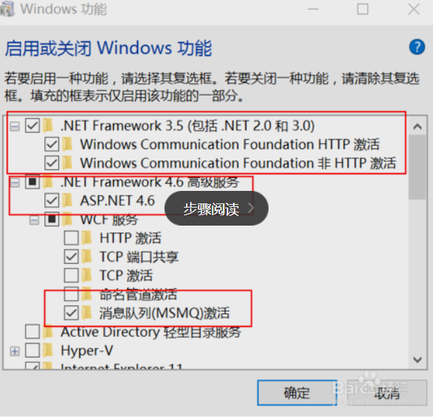
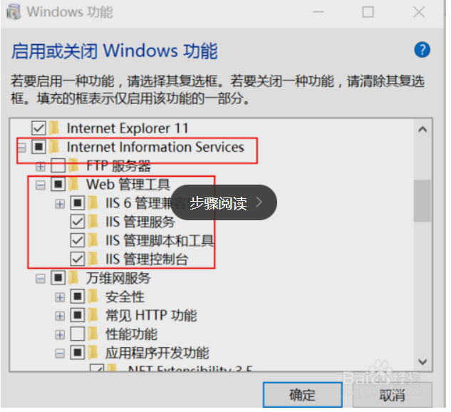
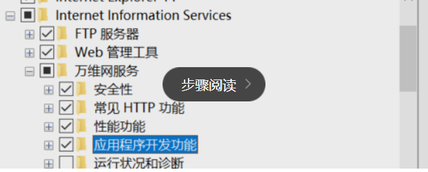

等待安装完成后，打开看IIS控制台。展开左边的站点树，右击，在属性里面点击新建网站。输入网站名称，和浏览器的端口号，默认端口是80端口，IIS默认端口就是80。不是80端口访问IP时就要带端口号。把网站的物理路径指定到您的网站本地路径。点击保存即可建立您的第一个网站了。

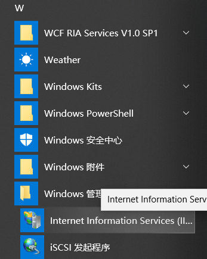

注意需要使用ctrl+s将网站保存为.html格式 文件名改为index，如果不改需要在默认文档中设置
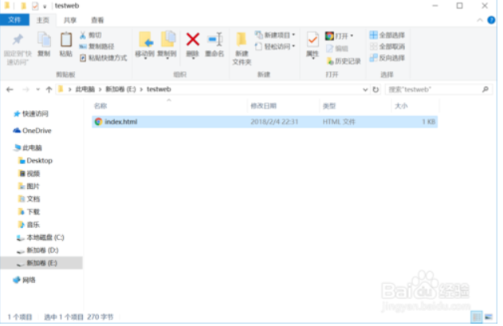

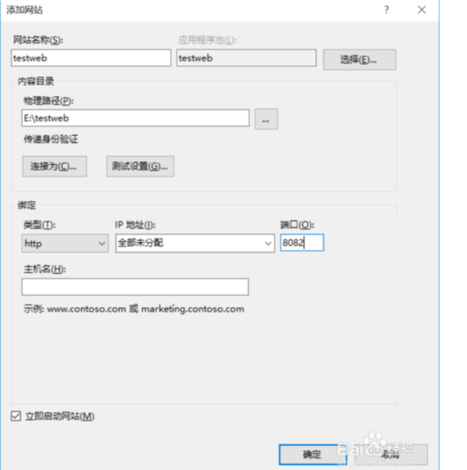

打开浏览器，在浏览器地址栏输入http://localhost:8082，即可浏览您的网站。（端口名字可自取）
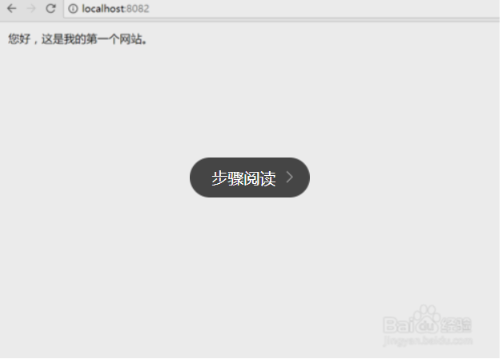

[重要]这里说一下默认文档的设置
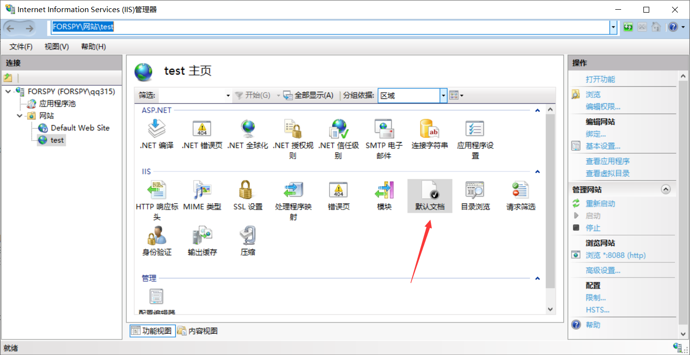
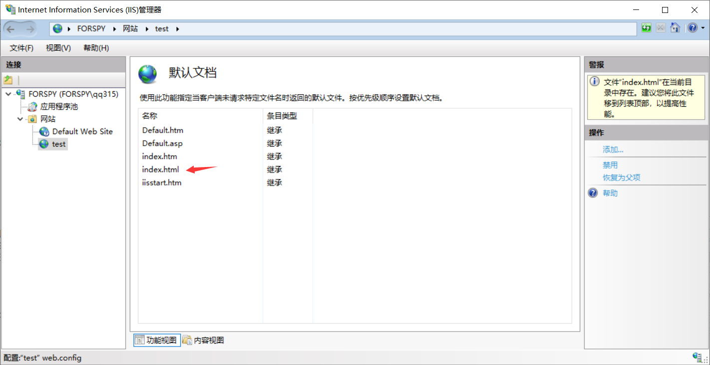

启用目录浏览可以看整个文件夹下面的文件信息与链接
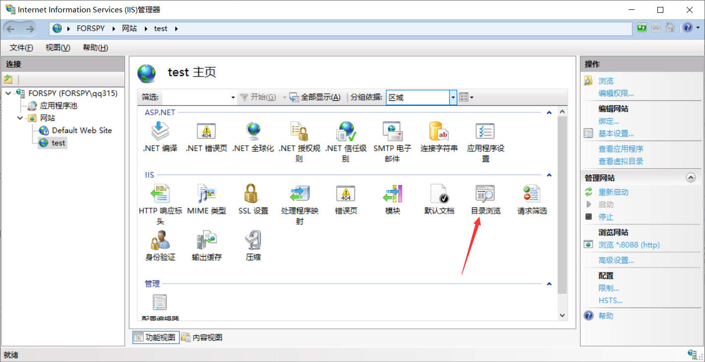
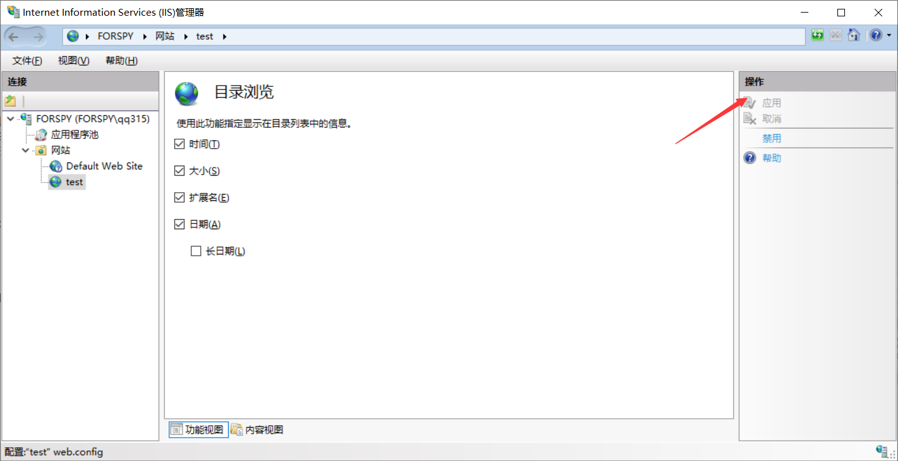

高级设置 重新设置网站路径
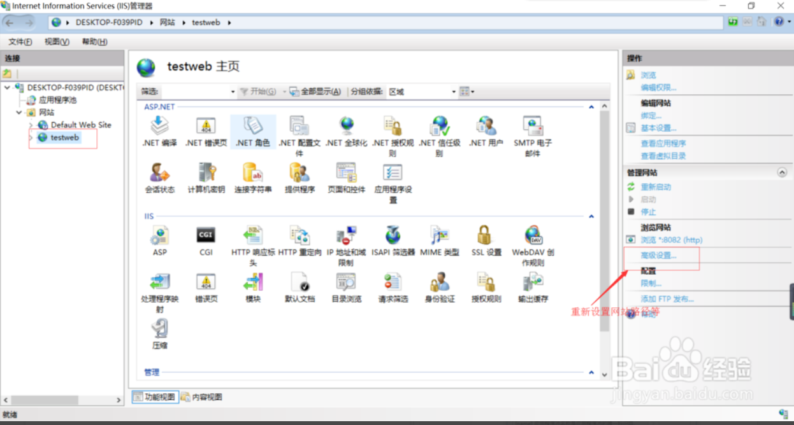

设置应用程序池
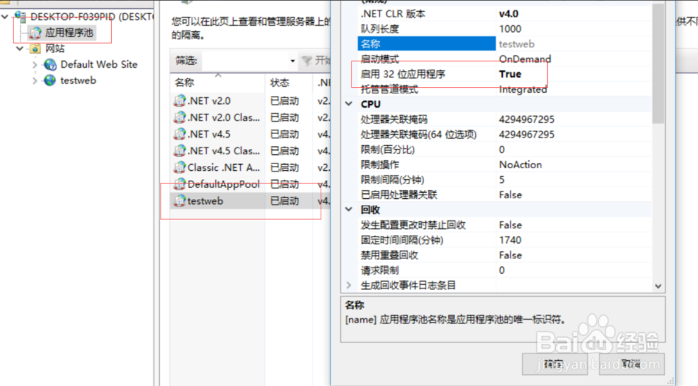

在同一局域网内的计算机都能连接该服务器并且能够读取.html文件，网站文件的搭建需要前端支持，也可ctrl+s

注意！本地服务器启动后需要手动关闭防火墙！！！
